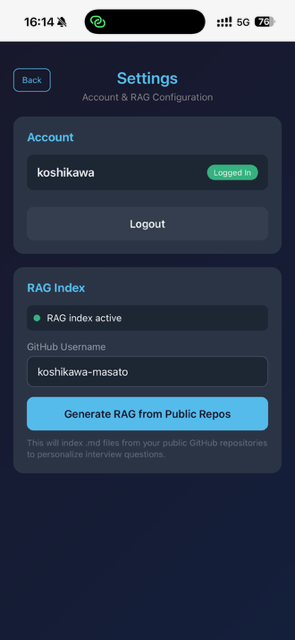

# Kuroko Interview

English interview practice web app with FAANG-level selection.

**Live Demo:** https://kuroko.three-sisters.ai

## Screenshots

<p align="center">
  
  
  
</p>

*Left: Select your target level (L4/L5/L6) | Center: AI asks personalized questions | Right: Connect GitHub for RAG*

## Core Technologies

| Technology | Purpose | Implementation |
|------------|---------|----------------|
| **LLM** | AI Interviewer | Claude API (Anthropic) - context-aware follow-up questions |
| **RAG** | Personalization | FAISS + OpenAI Embeddings - questions from YOUR projects |
| **STT** | Voice Input | OpenAI Whisper - speech to text |
| **TTS** | Voice Output | ElevenLabs - natural voice responses |

## Features

- **FAANG Level Selection** - Practice for L4 (Mid), L5 (Senior), or L6+ (Staff) interviews
- **Voice Input/Output** - Speak your answers, hear AI interviewer responses
- **RAG Integration** - Connect your GitHub to personalize questions based on your projects
- **Level-Specific Scoring** - Get feedback calibrated to your target level
- **Expert Mode** - Brutal interview with a merciless Principal Engineer (see below)
- **PWA Support** - Install on iPhone/Android for native-like experience

## Interview Modes

| Mode | Icon | Description |
|------|------|-------------|
| **Standard** | 🎯 | FAANG-style practice with supportive feedback |
| **Expert** | 💀 | "Try Yourself Mode" - No mercy, no escape |

### Expert Mode

Expert Mode is for those who want to be **truly challenged**. The interviewer becomes a Principal Engineer who:

- Has **read ALL your commits, docs, and past decisions**
- Points out **contradictions** between what you wrote and what you claim
- Asks about your **actual past mistakes** (visible in your history)
- Challenges every "we decided" with **"WHY did you decide that?"**
- Gives **no encouragement** - calls out shallow answers immediately
- Pushes until you reach **the edge of your knowledge**

**Requirements:**
- Must be logged in
- Must have RAG index generated (Expert Mode RAG recommended)

**Expert Mode RAG** uses:
- Full git clone (not shallow) to access commit history
- Heading-based chunking (h2/h3 sections for better context)
- Commit message extraction (thoughtful commits only, >50 chars)

## Interview Levels

| Level | Title | Experience | Focus Areas |
|-------|-------|------------|-------------|
| L4 | Mid-Level | 2-5 years | Feature ownership, basic system design, problem-solving |
| L5 | Senior | 5-8 years | Technical leadership, system design, mentoring |
| L6+ | Staff | 8+ years | Architecture decisions, cross-team influence, org-wide impact |

## Tech Stack

- **Backend:** FastAPI, Python
- **AI:** Claude API (Anthropic), OpenAI Whisper (STT)
- **TTS:** ElevenLabs
- **RAG:** FAISS + OpenAI Embeddings
- **Auth:** Cookie-based sessions with AES-256 encryption

## Architecture

```
┌─────────────────────────────────────────────┐
│              User (iPhone/Web)              │
└─────────────────┬───────────────────────────┘
                  │
┌─────────────────▼───────────────────────────┐
│            Kuroko Interview                 │
│  ┌─────────┐  ┌─────────┐  ┌─────────┐     │
│  │   STT   │→ │ Claude  │→ │   TTS   │     │
│  │(Whisper)│  │  API    │  │(Eleven) │     │
│  └─────────┘  └────┬────┘  └─────────┘     │
│                    │                        │
│              ┌─────▼─────┐                  │
│              │    RAG    │                  │
│              │  (FAISS)  │                  │
│              └───────────┘                  │
└─────────────────────────────────────────────┘
```

## Setup

### Requirements

- Python 3.10+
- API Keys: Anthropic, OpenAI, ElevenLabs

### Installation

```bash
# Clone
git clone https://github.com/koshikawa-masato/kuroko-voice-webapp.git
cd kuroko-voice-webapp

# Install dependencies
pip install -r requirements.txt

# Configure
cp .env.example .env
# Edit .env with your API keys

# Run
python main.py
```

### Environment Variables

```
ANTHROPIC_API_KEY=sk-ant-...
OPENAI_API_KEY=sk-...
ELEVENLABS_API_KEY=...
ELEVENLABS_VOICE_ID=JBFqnCBsd6RMkjVDRZzb
ENCRYPTION_KEY=...  # Generate with: python encryption.py
```

## Usage

1. Open https://kuroko.three-sisters.ai (or localhost:8000)
2. Select interview level (L4/L5/L6)
3. Click "Start Interview"
4. Tap microphone to answer questions
5. Click "End & Score" for feedback

### Personalized Questions (Optional)

1. Login/Register
2. Go to Settings
3. Enter your GitHub username
4. Click "Generate RAG"
5. Questions will now reference your actual projects

## How RAG Works

This app uses RAG (Retrieval-Augmented Generation) to personalize interview questions based on your actual projects.

### The Flow

```
┌─────────────────────────────────────────────────────────────────┐
│ 1. INDEX GENERATION (one-time setup)                            │
│                                                                 │
│   GitHub API          Clone Repos         Chunk & Embed         │
│   ┌─────────┐        ┌─────────┐         ┌─────────┐           │
│   │ List    │───────▶│ Clone   │────────▶│ .md     │           │
│   │ repos   │        │ (depth 1)│         │ files   │           │
│   └─────────┘        └─────────┘         └────┬────┘           │
│                                               │                 │
│                                               ▼                 │
│                                          ┌─────────┐           │
│                                          │ OpenAI  │           │
│                                          │Embedding│           │
│                                          └────┬────┘           │
│                                               │                 │
│                                               ▼                 │
│                                          ┌─────────┐           │
│                                          │ FAISS   │           │
│                                          │ Index   │           │
│                                          └─────────┘           │
└─────────────────────────────────────────────────────────────────┘

┌─────────────────────────────────────────────────────────────────┐
│ 2. INTERVIEW (every question)                                   │
│                                                                 │
│   Query: "technical projects AI LLM"                            │
│                      │                                          │
│                      ▼                                          │
│                 ┌─────────┐                                     │
│                 │ FAISS   │──▶ Top 10 relevant chunks           │
│                 │ Search  │                                     │
│                 └─────────┘                                     │
│                      │                                          │
│                      ▼                                          │
│   ┌─────────────────────────────────────────────────────┐      │
│   │ Claude System Prompt                                 │      │
│   │                                                      │      │
│   │ "You are interviewing for L5 Senior Engineer..."    │      │
│   │                                                      │      │
│   │ CANDIDATE'S BACKGROUND:                              │      │
│   │ [Source: AI-Vtuber-Project/README.md]               │      │
│   │ "Three-sister debate system using multi-agent..."   │      │
│   │                                                      │      │
│   │ [Source: Sisters-On-WhatsApp/README.md]             │      │
│   │ "WhatsApp bot with Claude API integration..."       │      │
│   └─────────────────────────────────────────────────────┘      │
│                      │                                          │
│                      ▼                                          │
│   Personalized Question:                                        │
│   "I see you've built an AI VTuber system with multi-agent     │
│    discussions. What was the biggest technical challenge?"      │
└─────────────────────────────────────────────────────────────────┘
```

### Why This Works

| Without RAG | With RAG |
|-------------|----------|
| "Tell me about your experience with Python" | "I see you built a multi-agent debate system. How did you handle state management between the three sisters?" |
| Generic questions | Questions about YOUR actual projects |
| Feels like talking to a script | Feels like talking to someone who read your resume |

### Technical Details

- **Embedding Model:** `text-embedding-3-small` (OpenAI)
- **Vector Store:** FAISS (Facebook AI Similarity Search)
- **Chunk Size:** 500 tokens with 50 token overlap
- **Index Sources:** `.md` files from public GitHub repos
- **Limits:** Max 10 repos, 5000 chunks total, 2000 chunks per repo

## Limits

- **Guest Mode:** 5 turns per session
- **RAG Generation:** Max 10 repos, 5000 document chunks

## License

MIT

## Author

Koshikawa Masato - [@koshikawa-masato](https://github.com/koshikawa-masato)

---

Built with Claude Code (Kuroko)
