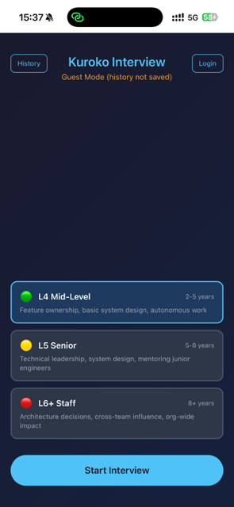
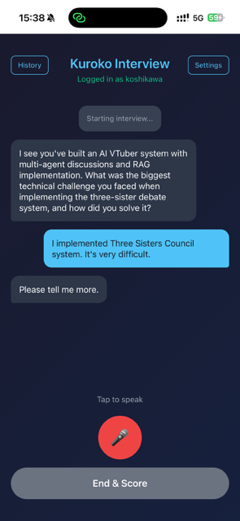

# Kuroko Interview

English interview practice web app with FAANG-level selection.

**Live Demo:** https://kuroko.three-sisters.ai

## Screenshots

<p align="center">
  
  
</p>

*Left: Select your target level (L4/L5/L6) | Right: AI interviewer asks personalized questions based on your GitHub projects*

## Features

- **FAANG Level Selection** - Practice for L4 (Mid), L5 (Senior), or L6+ (Staff) interviews
- **Voice Input/Output** - Speak your answers, hear AI interviewer responses
- **RAG Integration** - Connect your GitHub to personalize questions based on your projects
- **Level-Specific Scoring** - Get feedback calibrated to your target level
- **PWA Support** - Install on iPhone/Android for native-like experience

## Interview Levels

| Level | Title | Experience | Focus Areas |
|-------|-------|------------|-------------|
| L4 | Mid-Level | 2-5 years | Feature ownership, basic system design, problem-solving |
| L5 | Senior | 5-8 years | Technical leadership, system design, mentoring |
| L6+ | Staff | 8+ years | Architecture decisions, cross-team influence, org-wide impact |

## Tech Stack

- **Backend:** FastAPI, Python
- **AI:** Claude API (Anthropic), OpenAI Whisper (STT)
- **TTS:** ElevenLabs
- **RAG:** FAISS + OpenAI Embeddings
- **Auth:** Cookie-based sessions with AES-256 encryption

## Architecture

```
┌─────────────────────────────────────────────┐
│              User (iPhone/Web)              │
└─────────────────┬───────────────────────────┘
                  │
┌─────────────────▼───────────────────────────┐
│            Kuroko Interview                 │
│  ┌─────────┐  ┌─────────┐  ┌─────────┐     │
│  │   STT   │→ │ Claude  │→ │   TTS   │     │
│  │(Whisper)│  │  API    │  │(Eleven) │     │
│  └─────────┘  └────┬────┘  └─────────┘     │
│                    │                        │
│              ┌─────▼─────┐                  │
│              │    RAG    │                  │
│              │  (FAISS)  │                  │
│              └───────────┘                  │
└─────────────────────────────────────────────┘
```

## Setup

### Requirements

- Python 3.10+
- API Keys: Anthropic, OpenAI, ElevenLabs

### Installation

```bash
# Clone
git clone https://github.com/koshikawa-masato/kuroko-voice-webapp.git
cd kuroko-voice-webapp

# Install dependencies
pip install -r requirements.txt

# Configure
cp .env.example .env
# Edit .env with your API keys

# Run
python main.py
```

### Environment Variables

```
ANTHROPIC_API_KEY=sk-ant-...
OPENAI_API_KEY=sk-...
ELEVENLABS_API_KEY=...
ELEVENLABS_VOICE_ID=JBFqnCBsd6RMkjVDRZzb
ENCRYPTION_KEY=...  # Generate with: python encryption.py
```

## Usage

1. Open https://kuroko.three-sisters.ai (or localhost:8000)
2. Select interview level (L4/L5/L6)
3. Click "Start Interview"
4. Tap microphone to answer questions
5. Click "End & Score" for feedback

### Personalized Questions (Optional)

1. Login/Register
2. Go to Settings
3. Enter your GitHub username
4. Click "Generate RAG"
5. Questions will now reference your actual projects

## Limits

- **Guest Mode:** 5 turns per session
- **RAG Generation:** Max 10 repos, 5000 document chunks

## License

MIT

## Author

Koshikawa Masato - [@koshikawa-masato](https://github.com/koshikawa-masato)

---

Built with Claude Code (Kuroko)
